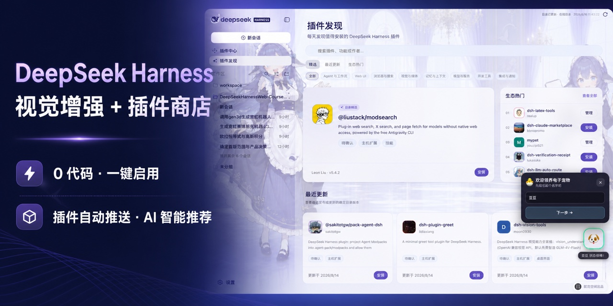
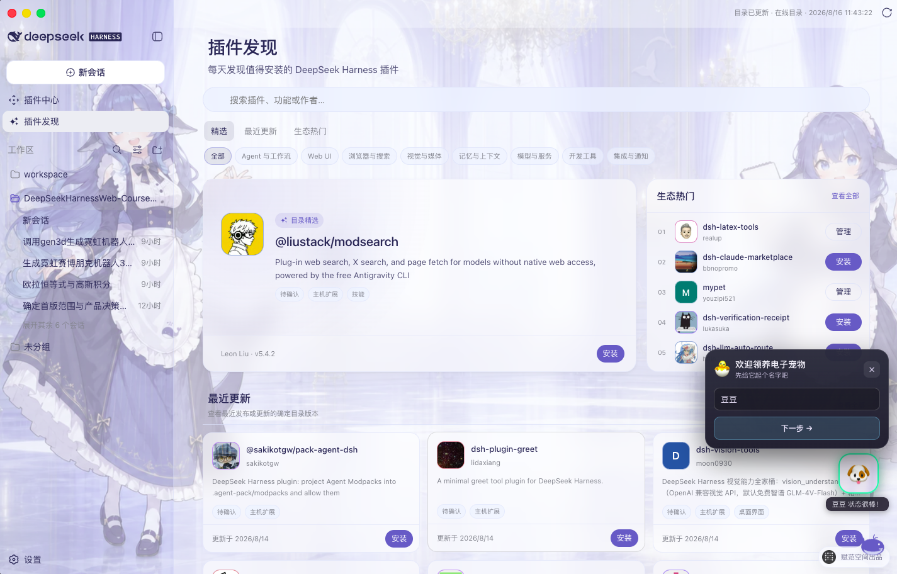
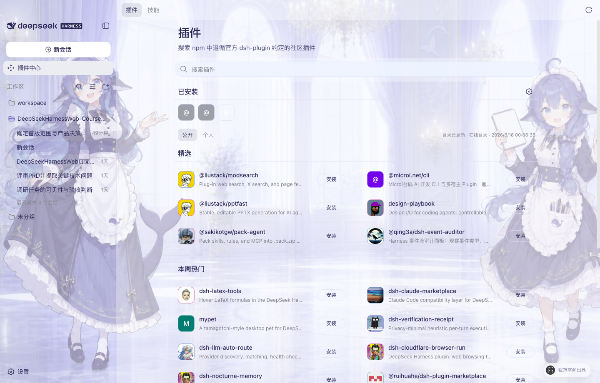

<p align="center">
  <a href="https://www.beyondata.com/">
    
  </a>
</p>

<h1 align="center">DeepSeek Harness Studio</h1>

<p align="center">
  <a href="https://github.com/fufankeji/deepseek-harness-studio/stargazers"></a>
  
  
  
  
  <a href="LICENSE"></a>
  
</p>

<p align="center"><a href="README.md">中文</a> · <strong>English</strong></p>

<p align="center"><strong>Built by Beyondata · Zero-code desktop enhancements for DeepSeek Harness</strong></p>

<p align="center"><strong>Vision enhancement + Plugin Store · Install, enable, and use plugins in one click</strong></p>

<p align="center">Automatically discover and surface new ecosystem plugins, with AI recommendations for useful capabilities; search, verify, install, enable, disable, and uninstall without the command line.</p>

<p align="center"><a href="https://github.com/fufankeji/deepseek-harness-studio/releases"><strong>Download the macOS arm64 development preview</strong></a> · <a href="https://github.com/fufankeji/deepseek-harness-studio/releases/download/desktop-preview-v0.1.0-rc.5/DeepSeek-Harness-Desktop-Windows-x64-0.1.0-rc.5-Setup.exe"><strong>Download the Windows x64 development preview</strong></a></p>

<p align="center">
  
</p>

## At a glance: available features and near-term roadmap

> Status key: ✅ Available; 🗓️ Planned. The desktop development workspace, public Plugin Center, and Chinese DeepSeek controls are available today. Planned capabilities will be updated only after the corresponding workflow is runnable.

| Capability | Status | What it enables |
| --- | --- | --- |
| **Plugin Discovery and recommendations** | ✅ | Read the public catalog automatically, browse featured, recently updated, ecosystem-popular, and scenario-based recommendations, and search by name, capability, or publisher. |
| **Public Plugin Center** | ✅ | Inspect exact versions, capabilities, permissions, compatibility, and risk, install online, and manage plugin enablement, updates, disabling, and removal. |
| **Desktop development workspace** | ✅ | Open local projects, manage sessions and workspaces, use Harness models, tools, Skills, and plugins, and modify the complete source code directly. |
| **Vision enhancement** | ✅ | Add image understanding to a text-based DeepSeek workflow by reading conversation attachments and workspace images, then providing traceable observations to the Agent. |
| **Chinese DeepSeek controls** | ✅ | Choose Chinese permission levels and DeepSeek-specific thinking modes directly in the composer for the current session. |
| **Built-in skins and custom backgrounds** | ✅ | Start with the whale-maid skin, switch to Cloud Cat, or choose a local image and let the app adapt its interface palette. |
| **Standalone MCP, Skills, and tool management** | 🗓️ | Add discovery and connection management for MCP servers, Skills, and tools that are not distributed as Bundles, then compose Agent capabilities per project. |
| **Agent presets and multi-Agent collaboration** | 🗓️ | Define Agents and subagents that collaborate across coding, testing, research, and review work. |
| **Planning, background runs, and session recovery** | 🗓️ | Manage plans and tasks, keep long-running work active in the background, inspect progress, and resume previous sessions. |
| **Project rules, hooks, and durable memory** | 🗓️ | Manage repository instructions, automation hooks, and reusable context so Agents work consistently with project rules. |
| **Git, worktrees, and code review** | 🗓️ | Develop concurrently in isolated worktrees, inspect diffs, commits, and review results, and reduce interference between tasks. |
| **Browser and desktop automation** | 🗓️ | Let Agents operate websites and local applications, then verify completion through real interaction results. |
| **Mobile remote access and channels** | 🗓️ | Inspect and resume tasks from a mobile device, and receive notifications or trigger Agents through common messaging channels. |

## Project overview

DeepSeek Harness Studio uses Electron to host the DeepSeek Harness Web workspace. The desktop main process starts and manages a local `dsh web` service. This repository provides the complete development source so users can clone or download it, install dependencies, edit the code, launch the desktop app, and continue development.

Desktop installers are published only through this repository's GitHub Releases page, never through a third-party download site. Electron-validated macOS arm64 and Windows x64 development previews are available now, while the complete source remains available for local development.

## Core features

- **Electron desktop app**: application window, system tray, single-instance behavior, external-link handling, and a restricted preload bridge.
- **Local Harness Host**: the desktop main process starts `dsh web`, waits for the local service to become ready, and stops the Host process when the app exits.
- **Web workspace**: DeepSeek Harness sessions, workspaces, models, tools, Skills, and plugin runtime remain available.
- **Plugin Discovery and recommendations**: read the online catalog and use featured, recently updated, ecosystem-popular, scenario filters, and search to find plugins worth trying.
- **Agent-assisted plugin search**: describe a need in natural language and let the Agent search the public `dsh-plugin` catalog, rank relevant candidates, and explain each recommendation.
- **Public Plugin Center**: search the public npm `dsh-plugin` ecosystem, verify the exact version, artifact integrity, Bundle declaration, and local compatibility before installation, then enable, disable, or uninstall entries from the Installed view.
- **Composer vision enhancement**: enable Bailian Qwen3.8 image understanding in one click for screenshots, photos, charts, OCR, and workspace images without replacing the current DeepSeek model.
- **Desktop appearance settings**: built-in Whale Maid and Cloud Cat skins, plus local backgrounds, subject focus, and interface glass controls.
- **Complete development source**: desktop app, Web interface, CLI, capability packages, native helpers, Python SDK, examples, and build scripts are kept in the repository.

## Plugin ecosystem: discover what is worth installing, then manage it

### Plugin Discovery: start here when you do not know what to install

Not sure where to find plugins, which ones were updated recently, or what the ecosystem is paying attention to? Open **Plugin Discovery** from the sidebar. The app reads the online catalog automatically and turns scattered packages into a recommendation page you can browse and act on directly.

<p align="center">
  
  <br><sub>Real Desktop interface: catalog feature, recently updated, ecosystem popular, scenario filters, search, and install or management actions.</sub>
</p>

- **A fresh place to start every day**: see catalog features, recently updated entries, and ecosystem-popular plugins without searching repositories one by one.
- **Filter by scenario**: browse Agents and workflows, Web UI, browser and search, vision and media, memory and context, models and services, developer tools, or integrations and notifications.
- **Search for the answer directly**: search by plugin name, capability keyword, or publisher, then inspect its icon, summary, version, and update time.
- **Act as soon as you discover it**: start the trusted installation flow for a new plugin, or jump to Plugin Center management for an installed one.

### Do not know the exact package name? Let the Agent shortlist it

When all you know is “I want a desktop pet,” you do not need to guess an npm package name first. Enter the need in **Plugin Discovery** and the app sends it to the current Agent as a `/find-plugins` request. The Agent loads the built-in Skill, performs a read-only search of the public `dsh-plugin` catalog, and returns the closest candidates with versions, publishers, update dates, and matching reasons in the current conversation.

<p align="center">
  
  <br><sub>Real Desktop acceptance run: the conversation asks for a desktop-pet plugin; the Agent loads <code>find-plugins</code>, searches the public catalog, and lists five relevant candidates from eight results.</sub>
</p>

- **No catalog vocabulary required**: describe the outcome, use case, or problem in ordinary language.
- **Evidence stays inspectable**: each result includes the exact package name, version, publisher, update date, and a matching reason.
- **Search and installation remain separate decisions**: recommendations are public-catalog metadata only; after choosing a package, use **Plugin Center** for compatibility checks and installation confirmation.

### Plugin Center: install, enable, disable, and remove online

<p align="center">
  
  <br><sub>Real Desktop interface: plugin avatars, public catalog, Installed area, Install buttons, and three-dot management actions.</sub>
</p>

After choosing a plugin, open **Plugin Center** to inspect plugins and Skill Packs in the public npm Registry that carry the `dsh-plugin` keyword and follow the DeepSeek Harness Bundle format, then complete the workflow from risk confirmation through runtime verification.

- **Online discovery**: search public plugins and inspect versions, capabilities, permissions, compatibility, and risk.
- **One-click installation**: download and verify an exact package version, integrity metadata, and Bundle declaration; after confirmation, Desktop installs it, restarts the Harness Host, and verifies runtime state.
- **Installed management**: review system, public-catalog, and local sources together, then enable, disable, update, or uninstall an entry from its three-dot menu.
- **Safe removal**: uninstall retains configuration and plugin data by default; deleting data requires a separate user confirmation.

## Built-in skins and custom backgrounds

Open **Settings → Background** to switch built-in skins. For a custom image, the app performs the 1920×1080 WebP crop and interface color adaptation locally without uploading the original.

<table>
  <tr>
    <td width="50%" align="center"></td>
    <td width="50%" align="center"></td>
  </tr>
  <tr>
    <td><strong>Whale Maid · Default</strong><br>Two blue-and-white whale assistants frame a bright palace while the center remains clear for conversation.</td>
    <td><strong>Cloud Cat</strong><br>The original soft blue-and-white cat theme remains available as a calm, low-distraction option.</td>
  </tr>
</table>

## Chinese permissions and DeepSeek model controls

- **Permission selection**: the composer uses the Chinese `只读`, `工作区写入`, and `完全访问` labels for the current session. General settings affect only new sessions, and enabling Full access requires an explicit risk confirmation.
- **Model and thinking modes**: the model and API key remain managed in Settings. The composer shows the current DeepSeek model and offers `关闭思考`, `深度思考`, and `最大思考` without inventing a speed setting that DeepSeek does not expose.

## Vision enhancement: let DeepSeek understand images

The text-based DeepSeek model used by the desktop workflow cannot interpret images directly. When vision enhancement is enabled, the built-in Bailian `qwen3.8-max` capability first reads image attachments or PNG, JPEG, WebP, and GIF files in the workspace, then gives the Agent a traceable visual observation. The existing DeepSeek model, permission level, and session flow remain unchanged.

- **Available in the composer**: use the “视觉增强” shortcut on the left side of the input bar; hover to see its purpose and current state.
- **Enabled through real verification**: the first activation verifies a Bailian API key with a real image; the credential remains in the protected local credential file.
- **Built for development work**: understand product screenshots, error dialogs, designs, charts, photos, and text in images, or inspect an image by its workspace path.

## Download the desktop app

> GitHub Releases provides Electron-validated macOS Apple Silicon and Windows x64 development previews. Running either desktop build requires no separate Node.js or pnpm installation. These remain development-preview assets; formal releases will provide platform-signed macOS `.dmg` and Windows x64 `.exe` installers.

<p align="center"><a href="https://github.com/fufankeji/deepseek-harness-studio/releases"><strong>Download the macOS arm64 preview</strong></a> · <a href="https://github.com/fufankeji/deepseek-harness-studio/releases/download/desktop-preview-v0.1.0-rc.5/DeepSeek-Harness-Desktop-Windows-x64-0.1.0-rc.5-Setup.exe"><strong>Download the Windows x64 installer</strong></a></p>

Development previews use a separate pre-release tag and include a SHA-256 checksum file without triggering the formal installer workflow. The formal workflow accepts only a `desktop-v*` tag that exactly matches the Desktop version, and publishes the macOS and Windows installers with `SHA256SUMS` only after both platform signatures pass verification.

## Quick start

### Get the source

Clone the repository with Git:

```sh
git clone https://github.com/fufankeji/deepseek-harness-studio.git
cd deepseek-harness-studio
```

You can also choose **Code → Download ZIP** on the GitHub repository page, extract the archive, and open the project directory.

### Requirements

- Node.js `^22.19.0 || >=24.0.0`
- pnpm `11.7.0`

### External services

Downloading the source, installing dependencies, and launching the desktop development environment do not require an API key. Configure the selected model provider and credentials in the application settings only when making model requests, and never commit credentials to Git.

<a id="run"></a><a id="run-from-source"></a>

### Install and run

Install the workspace dependencies:

```sh
pnpm install
```

Build the required modules and launch the desktop development environment:

```sh
pnpm run dev:desktop
```

The development launcher rebuilds when relevant source or build inputs change. To force a complete rebuild, run:

```sh
pnpm run dev:desktop:rebuild
```

## Repository layout

```text
deepseek-harness-studio/
├── apps/
│   ├── desktop/       # Electron main process, preload, Host lifecycle, and desktop build scripts
│   ├── web/           # DeepSeek Harness Web entry and desktop composition
│   └── cli/           # dsh CLI, runtime configuration, and Agent Presets
├── packages/          # Agent, model, tool, session, plugin, and client capability packages
├── native/            # Native sandbox helpers
├── python/            # Python SDK and related runtime
├── examples/          # Runnable examples and configurations
├── scripts/           # Build, validation, generation, and publishing scripts
├── website/           # Documentation site source
├── vendor/            # Pinned Cordis foundation source
└── assets/            # Project images used by the README
```

## Common development commands

| Command | Purpose |
| --- | --- |
| `pnpm run dev:desktop` | Build required modules and launch the Electron desktop app |
| `pnpm run dev:desktop:rebuild` | Force a complete rebuild before launching the desktop app |
| `pnpm run build` | Build the Host, client, Web, and desktop app |
| `pnpm run package:desktop` | Create an unpacked desktop app for the current platform |
| `pnpm run typecheck` | Run TypeScript type checks |
| `pnpm run test` | Run the Vitest unit suite |

## Suggested reading order

1. `apps/desktop/src/main.ts`: desktop entry, window, tray, and local Host composition.
2. `apps/desktop/src/host-supervisor.ts`: `dsh web` startup, readiness detection, and shutdown.
3. `apps/desktop/src/preload.ts`: fixed desktop interfaces exposed to the renderer.
4. `apps/web/`: the Web workspace loaded by the desktop window.
5. `apps/cli/` and `packages/`: CLI composition and Harness capabilities.

## Relationship to DeepSeek Harness

This project continues desktop development from the Harness core, Cordis plugin system, and Web interface in [deepseek-ai/deepseek-harness](https://github.com/deepseek-ai/deepseek-harness). This repository maintains the Electron desktop entry, local Host management, desktop interactions, and supporting development scripts.

## License

This project uses the [MIT License](LICENSE). Third-party license information is available in [THIRD_PARTY_NOTICES.md](THIRD_PARTY_NOTICES.md).
